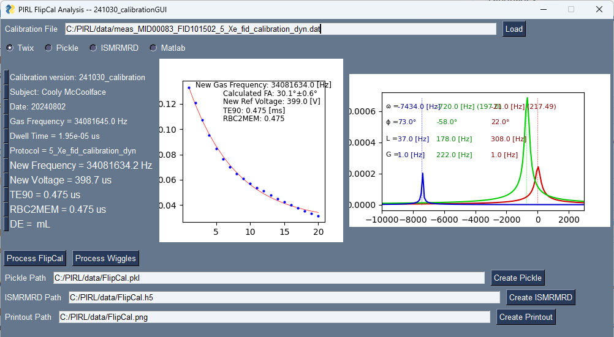

# XenonMRI
This is code used by the University of Missouri PIRL (Pulmonary Imaging Research Lab) to analyze 129Xenon MRI data from MRI pulse sequences described in [Peter Niedbalski's paper](https://onlinelibrary.wiley.com/doi/10.1002/mrm.28985). We have 2 major scipts here: FlipCal.py and Vent_analysis.py (dissolved xenon script coming soon!). Each script essentially contains a single class structure which can perform all analysis operations with just a few methods. The class structures can be called directly (e.g., CalibrationInstance = FlipCal(ismrmrd_path='path/to/my/data')) or you can run the script by itself in which case a GUI will run from the main() function call. 

## Authors:
- Robby Thomen [thomenr@health.missouri.edu]
- Gabriela Garcia Delgado
- Mia Ruppel
- Isabella Parks
- Afia Shammi

## Overview of FlipCal
This class will analyze data acquired from the spectroscopic calibration sequence (yes, I still call it a FlipCal, short for Flip Angle Calibration, even though it doesn't just calculate flip angles). It can input Twix files (Siemens raw data), MatLab files (MatLab workspace after processing data by Scott Robertson's code from the Duke pipeline), ISMRMRD files, or a previously processed FlipCal saved as a `pickle' in python. 

## Overview of Vent_analysis
There's 2 important pieces to this code. First, this contains the *Vent_Analysis* class which contains the processing pipeline for analyzing xenon ventilation data given the xenon image set (a DICOM file) and corresponding segmentation (a folder containing mask DICOMs). Second, the __main__ script employs the PySimpleGUI module to create a graphical user interface [GUI] so the data can be processed easily. Here's what the GUI looks like:

The [powerpoint](Vent_Analysis.pptx) gives an overview of how it all works. Essentially, you just plug in paths to your data and click the buttons for methods you want to run. Once they've run, the image windows will update with your data and you can export the analyses. Easy peasy!

## Setup
Using your favorite [git bash](https://git-scm.com/downloads) clone this github:  
  `git clone https://github.com/thomenr/Vent_Analysis`  
Next you'll need to install the python modules listed in the [requirements.txt](requirements.txt) file:  
  `pip install -r requirements.txt`  
Now, using your favorite [IDE](https://code.visualstudio.com/download), run the code (see the powerpoint for a few ways to do this - slide 3).
Follow the GUI instructions and you'll be calculating VDPs in no time!  

If you want, you can also create your own .exe to run the GUI without a python instance or anything...BUT, you'll need to compile the exe yourself in python. I didn't do that here, because the resultant exe is 183 Mb which is too big for github. If you want to create an exe it's super easy. Just install the PyInstaller module:  
  `pip install pyinstaller`  
Then, in powershell navigate to the repository directory and run the command in the [EXE_build_command.txt](EXE_build_command.txt) file. It will build the exe for you in a 'dist' folder. Done!  

## Things to do in future versions
 - Multiple VDPs calculated (linear binning, k-means)
 - edit mask
 - automatic segmentation using proton (maybe DL this?)
 - Denoise Option